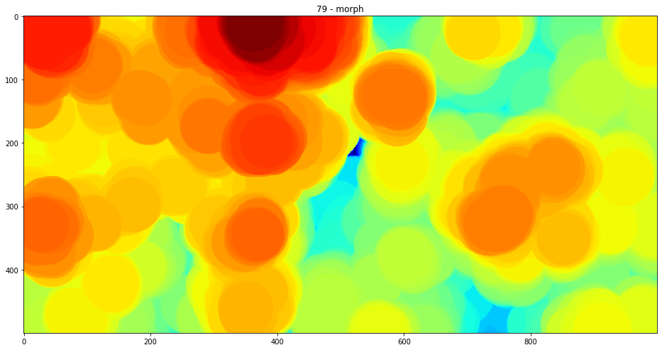
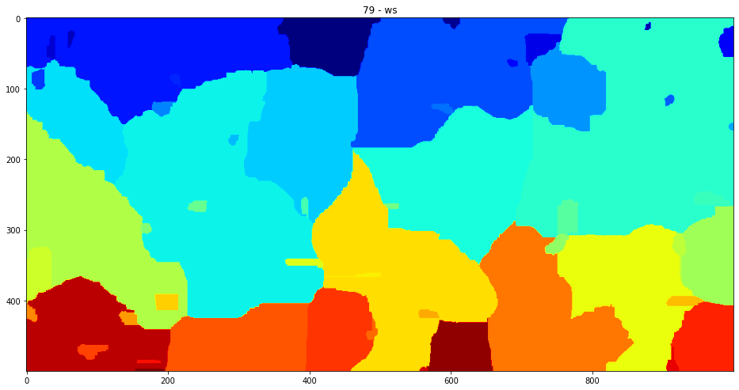

# Tree Crown Counting - Final Report - SCC5830

This is the last report concerning the experiments performed in order to count the tree crowns present in drone-captured data of a tropical forest.

In [section 1](#the-problem-at-hand), there is a description of the problem and the motivation behind it.  
In [section 2](#input-images), the input images are described in detail.  
In [section 3](#initial-approaches), the first two failed approaches are presented, making an inventory of the lessons learned([here](#lessons-learned) and [here](#lessons-learned-1)).  
[Section 4](#the-final-current-approach) presents the third and most successful experiment in great detail and future steps. Like the previous ones, the end of this section is a summary of [lessons learned](#lessons-learned-2).  
[Section 5](#conclusion) is a brief conclusion.

All work was done by me, Antonio Lutfi. This markdown file is generated from the jupyter notebook final_report.ipynb. It should be downloaded in order to run the code. Necessary libraries are listed under requirements.txt.

## The problem at hand

The main objective of this work is to segment drone-captured images of native forests into individual tree crowns. The main desired output is a simple counting of the trees, but any successful segmentation will also provide spacial data such as perimeter, area and altitude. This last one is possible because a 3d representation of the area is also available.

The specific images for this experiment are of a green area within the UFRRJ campus. There is a single stitched image of the whole flight and the tests and processing will be done in segments, such as the one below:


This application is intended to make forestry upkeep efforts less labor intensive. Today, making inventory of a forest requires frequent visits by foot. A reliable method to observe previously catalogued trees with a drone survey would make the job of forest engineers much easier.

Images are provided by Professor [Bruno Mendonça](https://institutos.ufrrj.br/if/bruno-araujo-furtado-de-mendonca/) and Fernando Canto. They were obtained with support from FAPERJ and UFRRJ.

## Input Images

Segmentation and tree counting will be done over a single image, generated by stitching together photos taken during a drone flight. The original stitched image is  24869 X 16367 pixels. A downscaled version is shown below:


Since this image was obtained by stitching, it was also possible to generate a 3D point cloud from the original drone footage, which helps tremendously with the task. [PyODM](https://github.com/OpenDroneMap/PyODM) was used to obtain such cloud. It is the python SDK for [OpenDroneMap](https://www.opendronemap.org/). This step is detailed at [pointcloud.ipynb](). Below, the point cloud and a depth-map, respectively.


## Initial Approaches

The first two approaches to this problem didn't yield good results. They are described ahead.

### 1 Segmenting by Texture with Haralick Descriptors

The first idea was to generate texture description for different species of trees, and segment the forest into these groups. However, the textures have very similar descriptors. On top of that, the current resolution does not allow for the forest engineers to reliably identify the species. So this first idea was abandoned.

#### Lessons Learned

Although clearly different to human eyes, describing these textures computationally in meaningful ways is very hard. Specially by using only grayscale. Maybe some other way of describing could have proved fruitful, but the inability of the engineers to classify tree species renders this speculation moot. Any technique that depends on a labeled dataset is not applicable.

### 2 Segmenting by Mean-Shift

Edge detection in this domain is very hard, so a more convoluted method was devised and tried. Firstly, we binarize the image using Otsu thresholding. Then we erode the binary image to exaggerate the gaps between trees. We then use this eroded binary as a mask over the grayscale version of the original image.

The idea is to use this masked image to perform mean shift segmentation. Since the top of the trees are more illuminated than the rest, we can use the pixel values as probabilities for the mean shift. The results were surprisingly good for a first approach, as the image below shows.


However, refining this method proved to be very complex and results never improved much. In addition, mean shifting is very computationally expensive, and performing it over the entire original image would take very long.

#### Lessons Learned

For starters, this was my first practical contact with mean shift. I don't think it is quite useful the way I applied it, but it was good to learn about a clusterization technique that doesn't depend on a previously determined number of clusters.

The use case was to shift each region to its neighborhood local maxima. But this is costly and inefficient. For images, the same could be achieved in an easier manner with morphological dilation, as was done in the final experiment.

## The ~~Final~~ Current Approach

The third and final experiment consists of implementing a variation of the method proposed in "An individual tree crown delineation method based on multi-scale segmentation of imagery" by Linhai Jing et. al., available [here](https://www.sciencedirect.com/science/article/abs/pii/S0924271612000767).

The modification is due to the visual aspects of the wooden area studied in the article and the one studied here. Even though Jing et al's forest is denser than many others found in different articles, it's still well behaved when compared to ours.


Trees, while touching each other, have way clearer borders than in our case and are way more convex:


Not only that, we have a point cloud available with the forest's depth information. For those reasons, the method had to be modified.


### Initial Setup

Imports


```python
from os import path

import cv2
import numpy as np
import matplotlib.pyplot as plt
from skimage.morphology import disk

# my libs
from img_utils import show, normalize
from point_cloud_tools import process_point_cloud
```

Constants


```python
R, G, B = 0, 1, 2
H, W, CH = 0, 1, 2
```

Image loading and downscale. The large resolution just slows things down while not adding much valuable information


```python
downscaling = 8

base_dir = '/media/antonio/Ubuntail/Dropbox/education/phd/courses/processamento_imagens/assignments/final'
main_img_path = path.sep.join([base_dir, 'images', 'mataDS.tif'])

p_cloud_dir = path.sep.join([base_dir, 'pyodm', 'entwine_pointcloud', 'ept-data'])
```


```python
main_img = cv2.imread(main_img_path)
print(main_img.shape)
main_img = cv2.resize(main_img, (main_img.shape[1] // downscaling, main_img.shape[0] // downscaling))
resolution = main_img.shape[:2]
```

    (16367, 24869, 3)


Generate depth map from point cloud (takes a while)


```python
depth_map, _ = process_point_cloud(p_cloud_dir, resolution)
```

Display results and images' resolutions


```python
show(depth_map)
print(depth_map.shape)
show(main_img)
print(main_img.shape)
```

    (2045, 3108)
    (2045, 3108, 3)


    

    


    

    


The ultimate goal is counting trees in the entire forest, but it's way faster to experiment with just a section


```python
h_head, h_tail = 600, 1100
w_head, w_tail = 1000, 2000
```


```python
rgb = main_img[h_head:h_tail, w_head:w_tail].copy()
depth = depth_map[h_head:h_tail, w_head:w_tail].copy()

rgb = normalize(rgb, (0, 255), np.uint8)
gray = normalize(cv2.cvtColor(rgb, cv2.COLOR_RGB2GRAY), (0, 255), np.uint8)
depth = normalize(depth)

show(rgb)
show(gray)
show(depth, cmap='jet')
```


    

    


    

    


    

    


Since there are some gaps in the depth map, a small dilation is necessary


```python
depth = cv2.dilate(depth, disk(3), iterations=1)
show(depth, cmap='jet')
```


    

    


### Method

The method consists in five steps, and I'll explain them quoting the article directly when necessary:

#### 1 Scale analysys
*"To explore the sizes of tree crowns, a series of disk
Structuring Elements (SEs) with a progressively increasing diameter from 3 in an increment of 2 pixels was employed in the (morphological) opening operation on the grayscale image [of the forest], and a series of
opened images was generated. For any two consecutive opened images, Od and Od+2 , where subscripts indicate the corresponding SE diameters, their difference image (Od+2 - Od) was computed and its mean value was calculated. There are a number of local minima in these. A local minimum occurs when there are significant differences in object sizes between two adjacent opened images. Therefore, these mean values reveal the dominant sizes of the objects and their size range captured in the image."*

In this approach, however, I'll perform these successive morphological operations over the depth-map. This is due to previously stated reasons of unclear borders between trees and low convexity shapes.

One other thing: I disagree --maybe due to a lack of understanding-- that the local minima in the means of differences mean a change of size. For me, this happens when an abrupt variation on these means occur.

Function that performs this morphological opening at different disk sizes:


```python
def get_crown_size_layers(img, min_disk=3, max_disk=85):
    opened = {'images': {}, 'mean_diffs': {}}
    images = opened['images']
    for disk_size in range(min_disk, max_disk, 2):
        images[disk_size] = normalize(cv2.morphologyEx(img, cv2.MORPH_OPEN, disk(disk_size)))
    
    mean_diffs = opened['mean_diffs']
    for i, disk_size in enumerate(images.keys()):
        if disk_size == min_disk:
            continue
        diff = images[disk_size] - images[list(images.keys())[i - 1]]
        euc_dist = np.sqrt(np.sum(diff ** 2))
        mean_diffs[disk_size] = euc_dist
    return opened

```


```python
csl = get_crown_size_layers(depth)
imgs = csl['images']
```

Plotting the means of the difference images


```python
xs = []
ys = []
for sz in csl['mean_diffs']:
    xs.append(sz)
    ys.append(csl['mean_diffs'][sz])

plt.rcParams["figure.figsize"] = (20,6)
plt.plot(xs, ys, '-o')
plt.xticks(np.arange(min(xs), max(xs) + 1, 2))
plt.show()
```


    

    


Choosing relevant sizes (manually for now)


```python
crown_sizes = [19, 21, 23, 25, 27, 31, 33, 35, 37, 47, 49, 51, 57, 59, 61, 73, 77, 79, 81, 83]
```

#### 2 Filtering

*"The multiple tree crown levels previously obtained using the scale analysis were used to design Gaussian filters for generating the multi-scale representation of the forest scene. Given any tree crown size of d pixels, a two-dimensional (2D) Gaussian filter with d * d window size was designed and its sigma (standard deviation, r) was set at a value of 0.3d pixels. This design was done in order to take account of various 3D radiometric shapes of tree crowns. When such a Gaussian filter was applied to a grayscale image, it was expected that tree crowns with a similar shape and size to the filter could be enhanced and smaller objects could be effectively suppressed."*

Again, this expects a fairly round tree crown.

Filtering grayscale image with different sized gaussian kernels


```python
def get_filtered(img, crown_sizes):
    filtered = {}
    for sz in crown_sizes:
        k = sz if sz % 2 == 1 else sz + 1
        filtered[sz] = normalize(cv2.GaussianBlur(img, (k, k), 0.3 * k), (0, 255), np.uint8)
    
    return filtered
```


```python
filtered = get_filtered(gray, crown_sizes)
```


```python
keys = list(filtered.keys())
for sz in [keys[0], keys[len(keys) // 2], keys[-1]]:
    show(filtered[sz], title=sz)
```


    

    


    

    


    

    


#### 3 Watershed Segmentation

*"Watershed segmentation applied for each gaussian-filtered version of the grayscale forest image obtained in step 2"*

The main difference from the article here is that we, again, take advantage of the 3D data. Instead of choosing the seeds for the watershed based on local minima of the blurred images -as the article does- we get it from the depth map. The idea is that, for a given scale, we get the highest point within that scale's radius for each pixel, instead of the whitest. This is only for the seeds, though, as the segmentation itself will be performed on the filtered images form step 2.

That means there will be small scales where branches will segmented, and large scales where maybe more than one tree crown will be clustered together. Further steps will refine these segmentations.

There is a catch, though. In morphological opening, the disk radius is the same as of the generated artifacts. While in morphological dilation, which we use to find local maxima, the resulting radius doubles. So we have to adjust.


```python
from segmentation import segment_by_depth as segment
```


```python
def multi_scale_segmenting(filtered, depth):
    result = {}
    depth = normalize(depth, (0, 255), np.uint8)
    for sz in filtered:
        se = disk(sz // 2)
        segmented, debug = segment(normalize(filtered[sz], (0, 255), np.uint8),
                                   depth,
                                   structuring_el=se,
                                   return_intermediate=True)
        result[sz] = {'ws': segmented, 'debug': debug}
    return result
```


```python
watershed = multi_scale_segmenting(filtered, depth)
```

Debugging function


```python
def view_debug(layers, filtered, orig_img, sz=None):
    if sz is not None and sz.__class__ == int:
        tf = lambda title: ' - '.join([str(sz), title])
        layer = layers[sz]
        debug = layer['debug']
        show(debug['morph'], cmap='jet', title=tf('morph'))
        show(debug['maxima'], title=tf('maxima'))
        show(debug['maxima_open'], title=tf('maxima_open'))
        show(debug['seeds'], cmap='jet', title=tf('seeds'))
        edges = debug['edges']
        
        show(layer['ws'], cmap='jet', title=tf('ws'))
        
        canvas = filtered[sz].copy()
        canvas[edges == 255] = 255
        show(canvas, title=tf('overlay - filtered'))

        canvas = orig_img.copy()
        canvas[edges == 255] = (255, 255, 255)
        show(canvas, title=tf('overlay - original'))
    else:
        szs = list(layers.keys()) if sz is None else sz
        [view_debug(layers, filtered, orig_img, sz=s) for s in szs]
        
```

View process results at 4 different sizes


```python
watershed.keys()
```


    dict_keys([19, 21, 23, 25, 27, 31, 33, 35, 37, 47, 49, 51, 57, 59, 61, 73, 77, 79, 81, 83])


```python
view_debug(watershed, filtered, rgb, [19, 33, 51, 79])

```

    /media/antonio/Ubuntail/Dropbox/education/phd/courses/processamento_imagens/assignments/final/SCC5830_final/img_utils.py:26: RuntimeWarning: More than 20 figures have been opened. Figures created through the pyplot interface (`matplotlib.pyplot.figure`) are retained until explicitly closed and may consume too much memory. (To control this warning, see the rcParam `figure.max_open_warning`).
      fig = plt.figure(figsize=plt_size)


    

    


    

    


    

    


    

    


    

    


    

    


    

    


    

    


    

    


    

    


    

    


    

    


    

    


    

    


    

    


    

    


    

    


    

    


    

    


    

    


    

    


    

    


    

    


    

    


    

    


    

    


    

    


    

    


##### Observations regarding step 3

It is clear that looking for local minima at the mean difference variation does not yield good segment sizes for this problem's domain. The larger sizes cluster a lot of trees together. It's necessary to experiment with other disk sizes and other methods of selecting the relevant ones. However, the segmentation itself usually follows the borders pretty well, so the method of dilating the depth map and segmenting over the filtered gray image is appropriate.

#### Steps 4 and 5 - Refinement of boundaries and multi-scale integration

These are the final steps in the procedure, but it is at this point that the differences between the two domains are most significant.

Both steps assume the afordmentioned circle-like aspects of the trees in the original article.

The article states that one of the ways to determine if a segment is a tree or a tree cluster is to measure its thinness ratio (4$\Pi$Area / perimeter<sup>2</sup>), which reaches 1 if the contour is a perfect circle. The logic behind it is that trees tend to be circular, where tree clusters would have a more fuzzy border.

The interesting thing is, for the forest studied here, the relation appears to be inverse. Trees tend to be oblong or have non-convex border, while clustered tree crowns usually form more of a circle, or dome in 3D.

Given these facts, implementing these steps will take more time to formulate, as following the article to the letter won't help much. These are the next steps, as this work will continue.

### Lessons Learned

As they are many, I'll enumerate what I learned so far by implementing this method.

1. Using morphological dilation to find local maxima was very interesting and, I believe, will be a very useful tool in the future.

2. Gaussian blurring as a way of emphasizing objects with sizes similar to the kernel is an ingenuous technique that I have not used before.

3. Watershed segmentation is much faster than I believed and very appropriate for these kinds of domain.

4. This is not exactly new, but it is a very different paradigm to write image processing software versus general applications. The data dictates the algorithm, which is the opposite of writing a web app, for example, where you have control over the format of everything. This makes it even more crucial to understand how each of the techniques work, to determine what the data demands.

5. This is very hard...

## Conclusion

As shown before, three experiments were performed. The last of them is still ongoing and is showing very promissing results on the segmentation. However, differentiating trees from tree parts is still a challenge to overcome.
